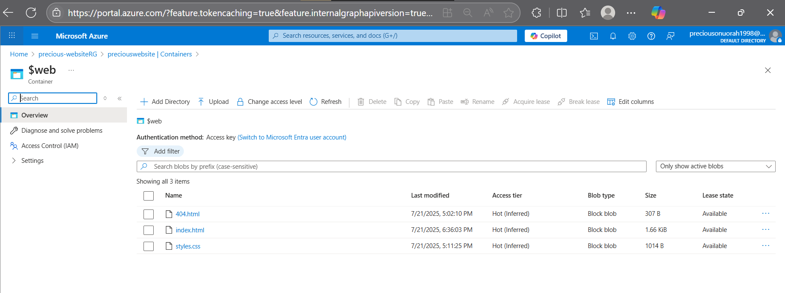

# cloud-resume-challenge
🚀 Cloud Resume Challenge built on Microsoft Azure. This project showcases my portfolio website featuring my resume, skills, certifications, and social links. It includes HTML/CSS, Azure Blob Storage (static website hosting), GitHub Actions for CI/CD, and future backend integrations like Azure Functions and Cosmos DB.

## 📌 Project Progress

| Stage | Description | Status | Notes |
|-------|-------------|--------|-------|
| 1 | **Azure Fundamentals Certification (AZ-900)** | 🔜 Pending | Passed and certified |
| 2 | **HTML Resume Created** | ✅ Done | `index.html` completed |
| 3 | **CSS Styling Applied** | ✅ Done | External `styles.css` used |
| 4 | Website Hosted on Azure Blob Storage | ✅ Done | Static site deployed: [Live Site](https://preciouswebsite.z6.web.core.windows.net/) |
| 5 | **HTTPS for Azure Storage URL using Azure CDN** | 🔜 Pending | Azure CDN profile created |
| 6 | **DNS Domain for Azure CDN endpoint** | 🔜 Pending | Custom domain added to Azure CDN endpoint |
| 7 | **Frontend JS for Visitor Counter** | 🔜 Pending | Integrate API with resume site |
| 8 | **Azure Cosmos DB / Table Storage** | 🔜 Pending | Store and retrieve visitor count data |
| 9 | **Azure Function Backend API (Visitor Counter)** | 🔜 Pending | Will handle API requests |
|10 | **Python Azure Function (Backend Logic)** | 🔜 Pending | Python code to handle serverless logic |
|11 | **Python Code Testing** | 🔜 Pending | Unit tests to ensure Azure Function logic is reliable and bug-free |
|12 | **Infrastructure as Code (Bicep/Terraform)** | 🔜 Optional | Automate resource provisioning |
|13 | **Source Control & CI/CD** | 🔜 Pending | GitHub repo and workflows to auto-deploy frontend and backend on code changes |
|14 | **CI/CD Pipeline for Backend** | 🔜 Pending | GitHub Actions to run tests and deploy Azure Function and IaC templates automatically |
|15 | **CI/CD Pipeline for Frontend** | 🔜 Pending | Automate frontend deployment to Azure Blob Storage via GitHub Actions, with optional CDN cache purge |
|16 | **Blog Post Summary** | 🔜 Pending | Will write and publish a short blog post reflecting on lessons learned during the Cloud Resume Challenge |

### ✅ Stage 4: Host Resume on Azure Static Website

I deployed my static HTML/CSS site to Azure Blob Storage using the static website hosting feature.

🔗 [Live Website](https://preciouswebsite.z6.web.core.windows.net/)

📸 Screenshot:

